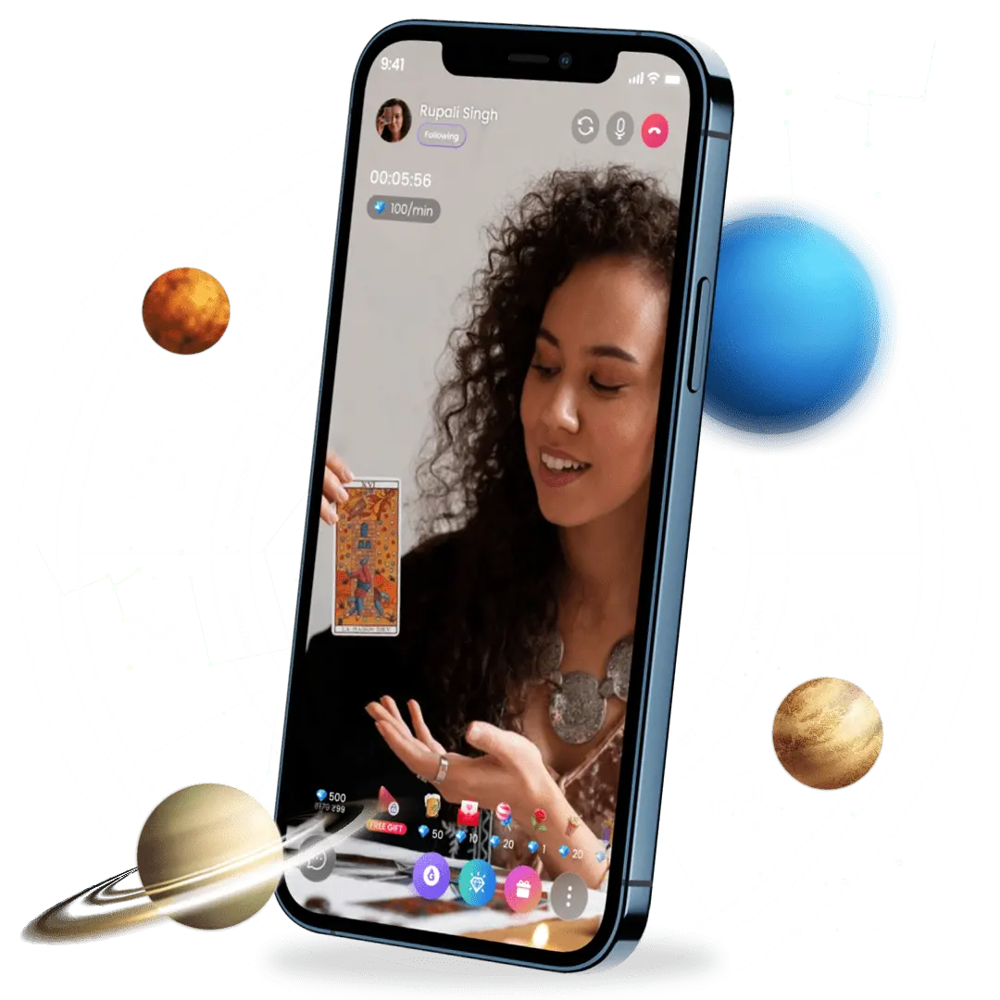
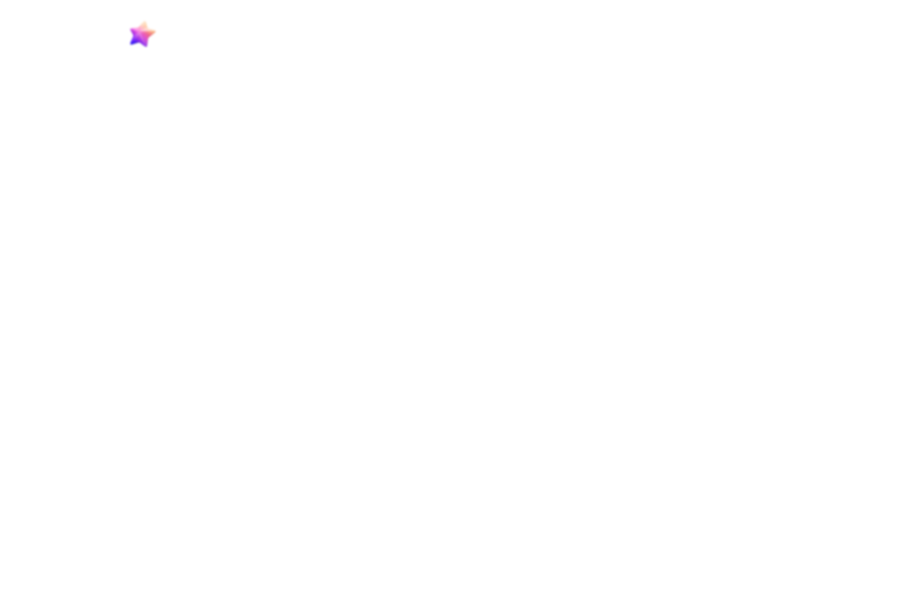

<div align="center">

#  <br/> AstroLive

###  **AstroHack 2026** 

**The Future of Vedic Astrology — Reimagined.**

A comprehensive, production-grade astrology platform blending ancient Vedic wisdom with modern web technology.
Featuring real-time live sessions, AI-powered Kundli generation, a spiritual e-commerce store, and an immersive cosmic UI.

[](https://nextjs.org)
[](https://react.dev)
[](https://typescriptlang.org)
[](https://tailwindcss.com)
[](LICENSE)

[🚀 Live Demo](#) · [📄 Documentation](#-features) · [🛠 Tech Stack](#-tech-stack) · [📸 Screenshots](#-screenshots)

</div>

---

##  Overview

**AstroLive** is a next-generation Indian astrology platform built for **AstroHack 2026**. We reimagined how millions interact with Vedic astrology by creating a seamless digital experience that connects users with real astrologers through chat, voice calls, and live video sessions — all wrapped in a stunning cosmic interface.

> _"We didn't just build a website. We built a complete astrology ecosystem — from birth chart generation to live streaming, from spiritual e-commerce to real-time consultations — in a single hackathon sprint."_

---

##  The Problem

- **900M+** astrology enthusiasts in India lack a single unified digital platform
- Existing apps are fragmented — horoscopes on one app, consultations on another, pooja booking on a third
- Poor UI/UX makes traditional astrology feel outdated and inaccessible to younger audiences
- No integration of real-time live streaming with astrological consultations
- Manual Kundli generation is time-consuming and error-prone

##  Our Solution

AstroLive — **one platform, every astrology need.** We built 18+ feature-rich pages covering the entire astrology lifecycle:

| Feature | What It Does |
|---|---|
| 🗣 **Live Consultations** | Chat, voice call, and video sessions with verified astrologers |
| 📺 **Live Streaming** | Watch astrologers stream live with real-time chat & reactions |
| 📊 **Kundli Generation** | Instant birth chart with Lagna & Moon charts, Vimshottari Dasha |
| 💑 **Kundli Matching** | Ashta Koota Gun Milan (36-point Vedic compatibility) |
| 🔮 **Horoscope Hub** | 12 zodiac signs × 5 timelines (Today → Yearly) |
| 📅 **Panchang & Muhurat** | Tithi, Nakshatra, Hora, Choghadiya — all calculated in real-time |
| 🛍 **Spiritual Store** | Gemstones, Rudraksha, Yantras — full e-commerce with cart |
| 💰 **Wallet System** | Tiered recharge packs with bonus cash incentives |
| 📖 **Free Reports** | 6 report types: Kaalsarp, Mangal Dosha, Gemstones, Numerology & more |
| 🧘 **Healing Hub** | Reiki, Feng Shui, Meditation, Crystal Therapy, Ayurveda |
| 🔮 **Occult Sciences** | Palmistry, Tarot, Vastu, Mantras, Lal Kitab guides |
| 📝 **Blog** | Curated articles on transits, mantras, and spiritual living |
| 📿 **Pooja Booking** | Book rituals with pandit details, dates, and Sankalp forms |
| 💕 **Love Calculator** | Zodiac-based compatibility with passion & communication analysis |

---

##  Tech Stack

| Layer | Technology | Why We Chose It |
|---|---|---|
| **Framework** | [Next.js 16](https://nextjs.org) (App Router) | Server components, file-based routing, optimal performance |
| **UI Library** | [React 19](https://react.dev) | Latest concurrent features, hooks-based architecture |
| **Language** | [TypeScript 5](https://typescriptlang.org) | Type safety across 4,000+ lines of code |
| **Styling** | [Tailwind CSS v4](https://tailwindcss.com) | Utility-first CSS, rapid prototyping, dark mode support |
| **Icons** | [Lucide React](https://lucide.dev) + [React Icons](https://react-icons.github.io) | Beautiful, consistent iconography |
| **Fonts** | Poppins + Playfair Display | Modern UI + elegant serif headings |
| **Deployment** | [Vercel](https://vercel.com) | Zero-config, instant deployments |

---

##  Key Highlights

###  Cosmic UI
An immersive **animated star field** background with twinkling stars, nebula glows, and constellation lines — built entirely in React with zero external libraries. Full **dark/light theme** system with 50+ CSS custom variables, persisted across sessions.

###  Responsive Mega Menu
A complex **8-level mega dropdown** navigation that adapts dynamically — menus with 6+ items render in 2-column layouts, mobile uses an accordion drawer. Supports both click and hover interactions with smooth transitions.

###  SVG Kundli Charts
Hand-crafted **North Indian diamond-style birth charts** rendered in pure SVG — no images, no libraries. Planetary positions labeled dynamically with Lagna and Moon chart variants.

###  Live Session Simulator
Full live-streaming UI with **real-time chat**, heart reactions, gift system, viewer counts, and multi-stream switching — demonstrating the architecture for production WebRTC integration.

###  E-Commerce + Wallet
Complete spiritual marketplace with category filtering, cart system, and a **wallet with tiered recharge packs** offering up to 30% bonus cash — the core monetization engine.

---

##  Project Structure

```
astrolive/
├── src/
│   ├── app/                              # 18 Next.js App Router pages
│   │   ├── page.tsx                      # Homepage
│   │   ├── layout.tsx                    # Root layout (Navbar + Footer + Theme)
│   │   ├── chat/page.tsx                 # Chat with Astrologers
│   │   ├── call/page.tsx                 # Call an Astrologer
│   │   ├── live/page.tsx                 # Live Sessions
│   │   ├── astrologer/[id]/page.tsx      # Dynamic Astrologer Profiles
│   │   ├── horoscope/page.tsx            # 12-Zodiac Horoscope Hub
│   │   ├── free-kundli/page.tsx          # Birth Chart Generator
│   │   ├── kundli-matching/page.tsx      # Vedic Marriage Compatibility
│   │   ├── free-reports/page.tsx         # 6 Free Astrology Reports
│   │   ├── panchang/page.tsx             # Panchang & Muhurat
│   │   ├── healing/page.tsx              # Healing & Wellness
│   │   ├── occult/page.tsx               # Occult Sciences
│   │   ├── pooja/page.tsx                # Pooja Booking
│   │   ├── love-calculator/page.tsx      # Love/Friendship Calculator
│   │   ├── blog/page.tsx                 # Blog
│   │   ├── store/page.tsx                # E-Commerce Store
│   │   └── wallet/page.tsx               # Wallet & Recharge
│   ├── components/
│   │   ├── Home.tsx                      # 820-line landing page
│   │   ├── Navbar.tsx                    # 597-line mega-menu nav
│   │   ├── Footer.tsx                    # Multi-column footer
│   │   ├── ThemeProvider.tsx             # Dark/light theme context
│   │   └── GlobalBackground.tsx          # Animated star field
│   └── lib/
│       └── astrologersData.ts            # Centralized data model
├── public/                               # Static assets (SVGs, images)
├── package.json
├── tailwind.config.ts
├── tsconfig.json
└── next.config.ts
```

---

##  Screenshots

<table>
  <tr>
    <td align="center"><b>🏠 Homepage</b></td>
    <td align="center"><b>🔮 Horoscope</b></td>
    <td align="center"><b>📊 Kundli</b></td>
    <td align="center"><b>📺 Live Sessions</b></td>
  </tr>
  <tr>
    <td></td>
    <td></td>
    <td></td>
    <td></td>
  </tr>
</table>

---

##  Getting Started

### Prerequisites
- **Node.js** 18+ (recommended: 20+)
- **npm**, **yarn**, or **pnpm**

### Installation

```bash
# Clone the repository
git clone https://github.com/your-team/astrolive.git
cd astrolive

# Install dependencies
npm install

# Run development server
npm run dev
```

Open [http://localhost:3000](http://localhost:3000) to see AstroLive in action.

### Available Scripts

| Command | Description |
|---|---|
| `npm run dev` | Start development server |
| `npm run build` | Production build |
| `npm run start` | Start production server |
| `npm run lint` | Run ESLint checks |

---

##  Future Roadmap

We built a solid foundation. Here's where AstroLive is headed:

| Phase | Feature | Impact |
|---|---|---|
| **Phase 1** | Backend API + Database (PostgreSQL + Prisma) | Real data persistence |
| **Phase 1** | Authentication (NextAuth.js) | Secure user accounts |
| **Phase 1** | Payment Gateway (Razorpay) | Real transactions |
| **Phase 2** | WebRTC Live Streaming | Production-grade video calls |
| **Phase 2** | AI-Powered Predictions | ML-based personalized readings |
| **Phase 2** | Push Notifications | Engagement & retention |
| **Phase 3** | Astrologer Dashboard | Earnings, analytics, scheduling |
| **Phase 3** | Mobile App (React Native) | Cross-platform reach |

---

##  Team

Built with  by the **AstroLive** team for AstroHack 2026.

---

##  License

This project is licensed under the **MIT License** — see the [LICENSE](LICENSE) file for details.

---

<div align="center">

###  Thank you for checking out AstroLive! 

**If you found this project impressive, consider giving it a ⭐**

</div>
